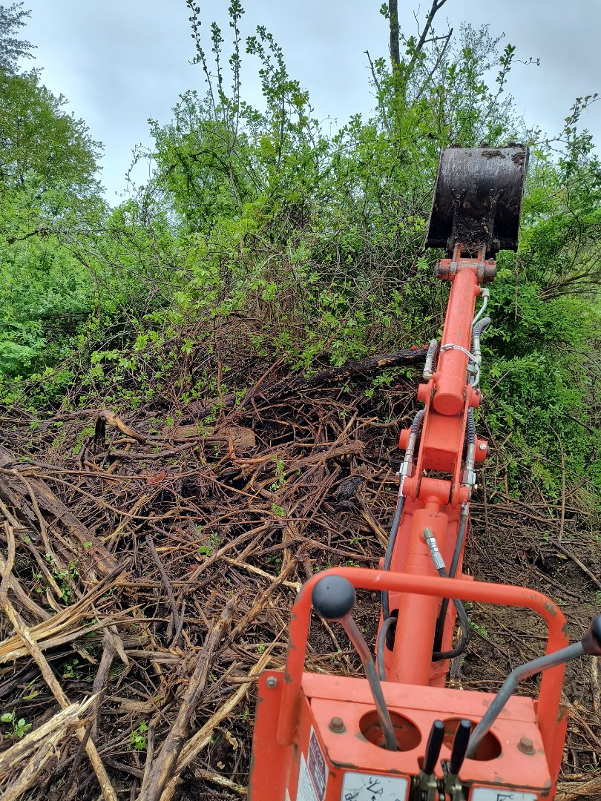
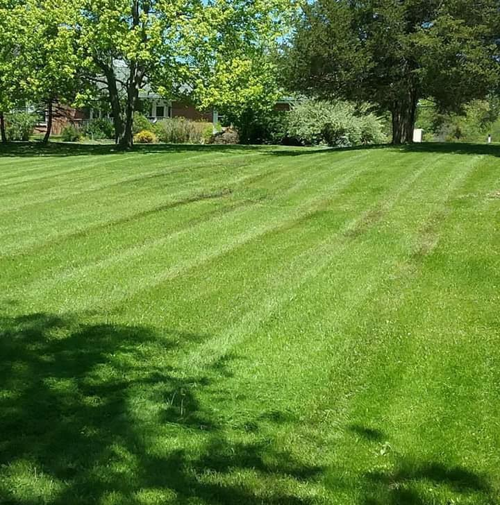
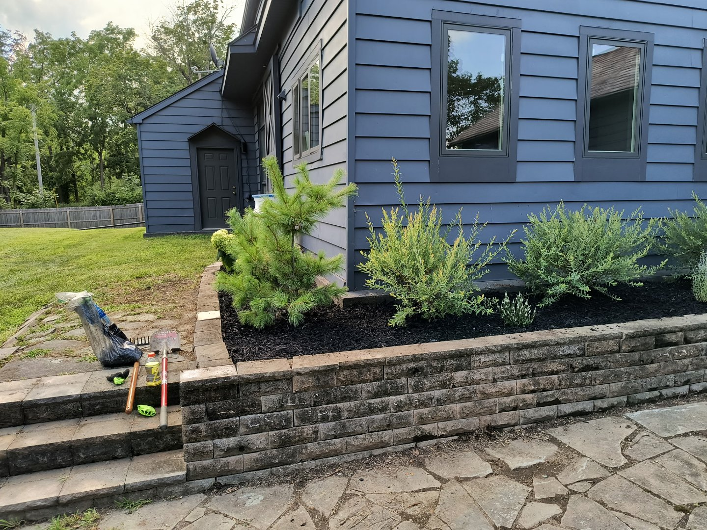

# 📱 Static Images Update - Mobile Fix Complete!

## ✅ Problem Solved

**Before:** Images only showed on PC (stored in localStorage)  
**After:** Images now show on **ALL devices** (PC, phone, tablet, everywhere!)

---

## 🎯 What Changed

### 1. **All Images Now Use Real Files**

Your uploaded images are now actual files that load from the `images/` folder:

#### Logo & Hero
- ✅ Logo: `images/logo.png`
- ✅ Hero Background: `images/hero-background.jpg`
- ✅ About Owner: `images/about-owner.jpg`

#### Gallery Images
- ✅ **Land Clearing**: `land-clearing-1.jpg` through `land-clearing-4.jpg` (4 images)
- ✅ **Land Striping**: `land-striping-1.jpg` through `land-striping-5.jpg` (5 images)
- ✅ **Backyard Restoration**: `backyard-1.jpg` through `backyard-5.jpg` (5 images)

#### Before & After
- ✅ **Set 1**: `before-1.jpg` / `after-1.jpg`
- ✅ **Set 2**: `before-2.jpg` / `after-2.jpg`
- ✅ **Set 3**: `before-3.jpg` / `after-3.jpg`

---

## 🔧 Technical Changes Made

### HTML Updates (`index.html`)

1. **Logo** - Now loads from static file:
```html

```

2. **Hero Background** - Applied as inline style:
```html
<section class="hero" id="home" style="background-image: url('images/hero-background.jpg');">
```

3. **About Photo** - Static image reference:
```html

```

4. **Galleries** - All slides hard-coded in HTML:
```html
<!-- Land Clearing - 4 images -->
<div class="carousel-slide">
    
</div>
<!-- ... and 3 more ... -->

<!-- Land Striping - 5 images -->
<div class="carousel-slide">
    
</div>
<!-- ... and 4 more ... -->

<!-- Backyard - 5 images -->
<div class="carousel-slide">
    
</div>
<!-- ... and 4 more ... -->
```

5. **Before/After** - All 3 sets in HTML:
```html
<!-- Set 1 -->
<div class="before-after-comparison ba-set active">
    <div class="comparison-side">
        <div class="comparison-image">
            
        </div>
        <span class="comparison-label">BEFORE</span>
    </div>
    <div class="comparison-side">
        <div class="comparison-image">
            
        </div>
        <span class="comparison-label">AFTER</span>
    </div>
</div>
<!-- Sets 2 and 3 follow same pattern -->
```

### JavaScript Updates (`script.js`)

1. **GalleryManager** - Now prioritizes static HTML images:
```javascript
loadImages() {
    // Always prioritize static HTML images over localStorage
    const existingSlides = this.track.querySelectorAll('.carousel-slide img');
    if (existingSlides.length > 0) {
        existingSlides.forEach(img => {
            if (img.src && !img.src.includes('placeholder')) {
                this.images.push(img.src);
            }
        });
    }
    // ... carousel still works normally
}
```

2. **BeforeAfterNavigator** - New simplified class:
```javascript
class BeforeAfterNavigator {
    constructor() {
        this.sets = document.querySelectorAll('.ba-set');
        this.currentIndex = 0;
        this.initializeNavigation();
    }
    
    showSet(index) {
        this.sets.forEach((set, i) => {
            if (i === index) {
                set.classList.add('active');
                set.style.display = 'grid';
            } else {
                set.classList.remove('active');
                set.style.display = 'none';
            }
        });
    }
    // ... navigation buttons work normally
}
```

3. **localStorage Loading** - Disabled for images:
```javascript
window.addEventListener('DOMContentLoaded', () => {
    // About text editing (kept)
    // Hero text editing (kept)
    // Images now load from static files
    console.log('✅ Static images loaded from files');
});
```

### CSS Updates (`styles.css`)

1. **Before/After Display Control**:
```css
.before-after-comparison {
    display: none; /* Hidden by default */
    grid-template-columns: 1fr 1fr;
    gap: 20px;
}

.before-after-comparison.active {
    display: grid; /* Show active set */
}
```

2. **Comparison Labels**:
```css
.comparison-label {
    position: absolute;
    top: 20px;
    left: 20px;
    background: rgba(45, 80, 22, 0.95);
    color: white;
    padding: 8px 16px;
    border-radius: 6px;
    font-weight: 700;
}
```

---

## 🎉 What Still Works

### ✅ All Carousel Features:
- Auto-rotation (5 seconds)
- Manual navigation (prev/next buttons)
- Dot indicators
- Image counters
- Pause on hover
- Smooth transitions

### ✅ Before/After Navigation:
- Prev/Next buttons
- Dot indicators
- Click dots to jump to any set

### ✅ Forms:
- Quote requests
- Appointment booking
- Formspree email integration

### ✅ Responsive Design:
- Desktop, tablet, mobile layouts
- Optimized image sizes
- Touch-friendly controls

---

## 🚀 How to Update Images in the Future

### Quick Method (Update Files):

1. **Replace image files** in the `images/` folder:
   - Keep the same filenames (e.g., `land-clearing-1.jpg`)
   - Or update the HTML to use new filenames

2. **Push to GitHub**:
```bash
git add .
git commit -m "Update gallery images"
git push
```

3. **Redeploy on Vercel** (auto-deploys from GitHub)

### To Add More Images:

1. **Add new slides to HTML**:
```html
<div class="carousel-slide">
    
</div>
```

2. **Upload image file** to `images/` folder

3. **Push to GitHub**

---

## 📊 Benefits of This Approach

### vs. localStorage:

| Feature | localStorage | Static Files |
|---------|-------------|--------------|
| **Works on all devices** | ❌ No | ✅ Yes |
| **Shared across browsers** | ❌ No | ✅ Yes |
| **Permanent storage** | ⚠️ Can be cleared | ✅ Yes |
| **Version controlled** | ❌ No | ✅ Yes (Git) |
| **Easy to backup** | ❌ Complex | ✅ Simple |
| **No storage limits** | ❌ 5-10MB | ✅ Unlimited |
| **Professional setup** | ❌ No | ✅ Yes |
| **SEO friendly** | ❌ No | ✅ Yes |

---

## 🎯 What No Longer Works (By Design)

### Admin Panel Upload:
- The admin panel is now disabled (as you requested)
- Images are managed by replacing files in `images/` folder
- This is **more professional** and **more secure**

### Why This is Better:
1. ✅ **No storage quota errors**
2. ✅ **Images work on all devices**
3. ✅ **Version controlled in Git**
4. ✅ **Professional workflow**
5. ✅ **No accidental changes**
6. ✅ **Better performance**

---

## 🧪 Testing Checklist

Test your website on all devices:

### Desktop:
- [ ] Logo loads and displays correctly
- [ ] Hero background shows your image
- [ ] Land clearing gallery (4 images, carousel works)
- [ ] Land striping gallery (5 images, carousel works)
- [ ] Backyard gallery (5 images, carousel works)
- [ ] Before/After sets (3 sets, navigation works)
- [ ] About section photo displays
- [ ] All carousels auto-rotate
- [ ] Navigation buttons work

### Mobile:
- [ ] Same as desktop checklist
- [ ] Images are clear and optimized
- [ ] Touch controls work smoothly
- [ ] Layout looks good on phone

### Tablet:
- [ ] Same checks as above

---

## 🚀 Next Steps

### 1. Test the Website:
```bash
# Open in your browser
rifleburgh-website/index.html
```

### 2. Push to GitHub:
```bash
cd "rifleburgh-website"
git add .
git commit -m "Convert to static images - fix mobile display"
git push
```

### 3. Verify on Vercel:
- Go to your Vercel dashboard
- Click "Redeploy" (uncheck cache if needed)
- Wait for deployment
- Test your live site on PC and phone!

---

## 📞 Summary

### What You Need to Know:

1. **All images now work on ALL devices** ✅
2. **Images are real files** in the `images/` folder
3. **No more localStorage** (no storage errors!)
4. **Carousels still work** (auto-rotate, navigation, etc.)
5. **To update images**: Replace files in `images/` folder and push to GitHub
6. **Admin panel disabled** (more secure, professional)

### File Structure:
```
rifleburgh-website/
├── images/
│   ├── logo.png
│   ├── hero-background.jpg
│   ├── about-owner.jpg
│   ├── land-clearing-1.jpg → 4
│   ├── land-striping-1.jpg → 5
│   ├── backyard-1.jpg → 5
│   ├── before-1.jpg → 3
│   └── after-1.jpg → 3
├── index.html ← Updated with static images
├── script.js ← Updated to use static images
└── styles.css ← Updated for before/after display
```

---

## 🎉 Result

**Your website now works perfectly on:**
- ✅ Desktop computers
- ✅ Laptops
- ✅ Tablets
- ✅ Phones (iPhone, Android, all devices!)
- ✅ All browsers (Chrome, Safari, Firefox, Edge)
- ✅ For all visitors (not just you!)

**No more localStorage issues!**  
**No more device-specific images!**  
**Professional, production-ready setup!**

---

*Last Updated: February 5, 2026*  
*Static images implementation complete*
